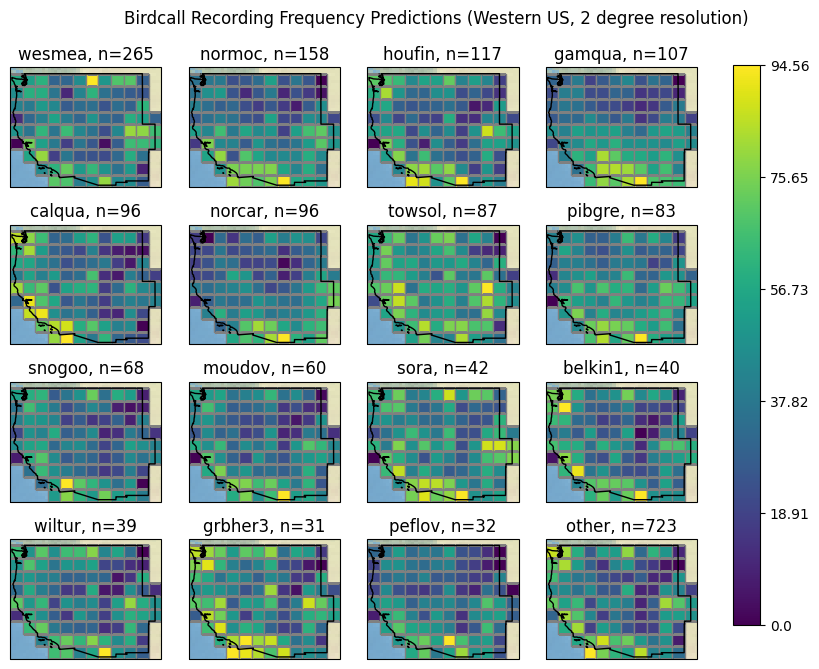

# bircall-distribution

This repository contains [IYSE 6420](https://omscs.gatech.edu/isye-6420-bayesian-statistics) project code for building BirdCLEF birdcall distribution maps.
It uses Bayesian modeling techniques to estimate frequencies of birdcall recording metadata.
This project relies heavily on [PyMC](https://www.pymc.io) and [Google Earth Engine](https://earthengine.google.com/).

Below are a few plots from the project, which are discussed in more detail in the report.


_Distribution of the California Quail smoothed using the a Poisson GLM with a CAR prior distribution for random effects._



_Poisson GLM posterior predictive species distribution map of the top 15 species in the Western US._

## quickstart

Make sure you have Python and [poetry](https://python-poetry.org/) installed.

```bash
poetry install
poetry shell
```

Notebooks with exploratory data analysis and initial modeling are found in the [notebooks](./notebooks/) directory.
We try to consolidate most code into the `birdcall_distribution` package.

If you are contributing, make sure to install and initialize [pre-commit](https://pre-commit.com/).

```bash
pip install pre-commit
pre-commit install
```

## miscellaneous

### fetching data against Google Earth Engine

You will need to be authenticated against Google Earth Engine.
Check out one of the earlier notebooks to see how this works.

To get statistics about elevation, temperature, and land cover classification:

```bash
# v1 - includes basic information
python -m birdcall_distribution.commands.earth_engine data/earth_engine.parquet

# v2 - includes the grid size
python -m birdcall_distribution.commands.earth_engine --parallelism 16 data/earth_engine_v2.parquet

# v3 - add a new region, use percentiles as primary data summarization technique
python -m birdcall_distribution.commands.earth_engine --parallelism 16 ca 1 data/ee_v3_ca_1.parquet
python -m birdcall_distribution.commands.earth_engine --parallelism 16 western_us 2 data/ee_v3_western_us_2.parquet
python -m birdcall_distribution.commands.earth_engine --parallelism 16 americas 2 data/ee_v3_americas_2.parquet
python -m birdcall_distribution.commands.earth_engine --parallelism 16 americas 5 data/ee_v3_americas_5.parquet
```

These are saved as parquet files and are checked into the repository.

### generating assets for demo

```bash
python -m birdcall_distribution.commands.model_assets intercept_car data/ee_v3_americas_5.parquet data/processed/models/intercept_car/americas/5 --n-species 10 --cores 4 --samples 5000

python -m birdcall_distribution.commands.model_assets intercept_car data/ee_v3_western_us_2.parquet data/processed/models/intercept_car/western_us/2 --n-species 10 --cores 4 --samples 5000

python -m birdcall_distribution.commands.model_assets intercept_car data/ee_v3_ca_1.parquet data/processed/models/intercept_car/ca/1 --n-species 10 --cores 4 --samples 5000


python -m birdcall_distribution.commands.model_assets intercept_covariate_car data/ee_v3_americas_5.parquet data/processed/models/intercept_covariate_car/americas/5 --n-species 10 --cores 4 --samples 5000

python -m birdcall_distribution.commands.model_assets intercept_covariate_car data/ee_v3_western_us_2.parquet data/processed/models/intercept_covariate_car/western_us/2 --n-species 10 --cores 4 --samples 5000

python -m birdcall_distribution.commands.model_assets intercept_covariate_car data/ee_v3_ca_1.parquet data/processed/models/intercept_covariate_car/ca/1 --n-species 10 --cores 4 --samples 5000
```

We also generate the manifest:

```bash
python -m birdcall_distribution.commands.generate_manifest data/processed data/processed/manifest.json
```

### uploading data directory to google cloud

We have set up a public facing bucket with copies wheels and data files.
To upload new data, authenticate against `gcloud` and ensure you have access to the `acmiyaguchi` project.

```bash
gcloud storage buckets create gs://iyse6420-birdcall-distribution
gcloud storage cp -r data/ gs://iyse6420-birdcall-distribution/
```

### installing cartopy on windows

The majority of development was done on a Windows 10 machine.
[Cartopy](https://scitools.org.uk/cartopy/docs/latest/), which is used for plotting, is not available on Windows as a wheel.
This is because it needs to be linked against system packages.
Download the packages from: https://www.lfd.uci.edu/~gohlke/pythonlibs/

We also have a copy of the wheels in the cloud storage bucket, which can be synced down.

### converting svg images

The graphviz images need to be converted into png so we can embed them into the the report.
Use inkscape to do this:

```bash
inkscape full_model.svg --export-type=png --export-filename=full_model.png
```

## References

Here's a list of many of the resources that were used while building this project.
This does not encompass everything, because some references are in the report or notebooks.

### google earth engine and remote sensing data

- tutorials
  - https://developers.google.com/earth-engine/tutorials/community/intro-to-python-api
  - https://developers.google.com/earth-engine/tutorials/community/drawing-tools
- datasets
  - https://esa-worldcover.org/en/data-access
  - https://worldcover2020.esa.int/
  - https://cloud.google.com/storage/docs/public-datasets/landsat
  - https://modis.gsfc.nasa.gov/data/dataprod/mod12.php
  - https://developers.google.com/earth-engine/datasets/catalog/MODIS_006_MCD12Q1#bands
  - https://sedac.ciesin.columbia.edu/data/collection/gpw-v4
- questions
  - https://gis.stackexchange.com/questions/419979/calculating-pixel-area-in-region-using-esa-worldcover-10-m-v100-in-google-earth
  - https://spatialthoughts.com/2020/06/19/calculating-area-gee/
  - https://gis.stackexchange.com/questions/407240/code-for-generating-tiles-grids-on-google-earth-engine
  - https://gis.stackexchange.com/questions/304929/what-is-the-difference-between-sample-sampleregions-and-stratifiedsample-in-go
  - https://gis.stackexchange.com/questions/388608/reduceregions-google-earth-engine-python-api
- misc
  - https://uoftcoders.github.io/studyGroup/lessons/python/cartography/lesson/
  - https://github.com/pangeo-data/cog-best-practices/blob/main/2-dask-localcluster.ipynb

### modeling geospatial data

- tutorials and reading
  - https://www.pymc-labs.io/blog-posts/spatial-gaussian-process-01/
  - https://docs.pymc.io/en/v3/pymc-examples/examples/case_studies/conditional-autoregressive-model.html
  - https://atlas.cancer.org.au/developing-a-cancer-atlas/Chapter_4.html
    - great summary of models
  - https://cran.r-project.org/web/packages/CARBayes/vignettes/CARBayes.pdf
    - useful vignette
  - https://mc-stan.org/users/documentation/case-studies/mbjoseph-CARStan.html
    - stan implementation
  - [Spatial Statistical Models: An Overview under the Bayesian Approach](https://www.mdpi.com/2075-1680/10/4/307)
  - [Bayesian analysis of conditional autoregressive models](https://www.ism.ac.jp/editsec/aism/pdf/10463_2010_Article_298.pdf)
  - [The Poisson-Lognormal Model as a Versatile Framework for the Joint Analysis of Species Abundances](https://www.frontiersin.org/articles/10.3389/fevo.2021.588292/full)
  - https://twiecki.io/blog/2014/03/17/bayesian-glms-3/
  - https://docs.pymc.io/en/v3/pymc-examples/examples/case_studies/multilevel_modeling.html
- pymc
  - https://github.com/pymc-devs/pymc/wiki/Set-up-JAX-sampling-with-GPUs-in-PyMC-v4
  - https://oriolabrilpla.cat/python/arviz/pymc3/xarray/2020/09/22/pymc3-arviz.html
    - coordinates in pymc
  - http://stronginference.com/missing-data-imputation.html
- issues modeling because wrong parameterization
  - https://timeseriesreasoning.com/contents/exogenous-and-endogenous-variables/
  - https://stats.stackexchange.com/questions/561263/poisson-or-binomial-distribution-for-modeling
  - https://onlinelibrary.wiley.com/doi/full/10.1111/ecog.06022
    - bernoulli?
  - https://www.pymc.io/projects/examples/en/latest/generalized_linear_models/GLM-negative-binomial-regression.html
  - https://discourse.pymc.io/t/issues-with-poisson-regression-using-glm-method/1053
  - https://discourse.pymc.io/t/biased-results-from-poisson-regression-model/4349/3
  - [Regression Analysis with Right-Skewed Data](https://files.alz.washington.edu/presentations/2020/fall/Malek-Ahmadi.pdf)
